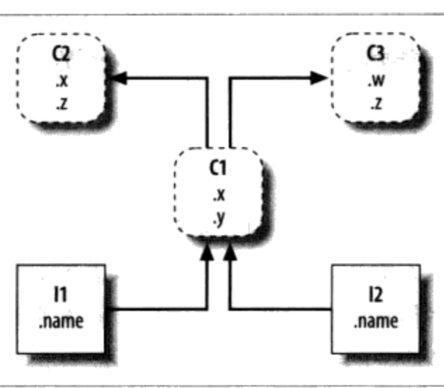

# Chapter9 类和OOP

类的继承，类树，低端有两个实例(l1,l2),在它上有个类(c1),而顶端有两个超类/基类(c2和c3)。继承就是由下至上搜索此树，来寻找属性名称所出现的最低的地方。
* I1.x 和 I2.x 两者都会在 C1 中找到 x 并停止搜索，因为 c1 比 c2 位置低。
* I1.y 和 I2.y 两者都会在 C1 中找到 x 并停止搜索，因为 y只出现在c1中。 
* I1.z 和 I2.z 两者都会在 C2 中找到 z 并停止搜索, 因为 c2 比 c3 更靠左侧。

以双下划线命名的方法(\_\_x\_\_)是特殊的钩子：
* 当新的实例构造时，会调用\_\_x\_\_
* 当实例出现在 + 表达式时，会调用\_\_add\_\_或者\_\_sub\_\_
* 当打印一个对象的时候，运行\_\_str\_\_
* 当初始化对象时，直接运行 \_\_init\_\_和 \_\_call\_\_

```python
class FirstClass(object):
    def setdata(self,value):
        self.data = value
    def display(self):
        print(self.data)

class SecondClass(FirstClass):
    def __init__(self,value):
        self.data = value
    def __add__(self,other):
        return SecondClass(self.data + other)
    def __str__(self):
        return 'hello：%s'%self.data


y = SecondClass('adc') 
y.display() #adc
print(y)    #hello：adc 直接调用 __str__
b = y + 'xyz'   #使用+号时，直接调用 __add__
b.display()     #adcxyz
```
# 装饰器和元类：第一部分
函数装饰器提供了一种方式，替函数明确了特定的运算模式，也就是将函数包裹了另外一层，在另一函数的逻辑内实现。

如今的静态方法可以用下面的装饰器语法编写，
```python
class C:
    @staticmethod
    def meth():
        pass

#等价于
class C：
    def meth():
        pass
    meth = staticmethod(meth)
```

比如：
```python
class Spam:
    numInstances = 0
    def __init__(self):
        Spam.numInstances = Spam.numInstances +1
    
    @staticmethod
    def printNumInstances():
        print("Number of instances: ",Spam.numInstances)

a= Spam()
b = Spam()
c = Spam()
Spam.printNumInstances()#静态方法可以不用实例参数
a.printNumInstances()
# Number of instances:  3
# Number of instances:  3
```
## 装饰器例子
```python
class tracer:
    def __init__(self,func):
        self.calls = 0
        self.func = func
        print("my name :", self.func.__name__)
    def __call__(self,*args):
        self.calls +=1
        print('call %s to %s'%(self.calls,self.func.__name__))
        self.func(*args)
    
#和语句一样：spam = tracer(spam),然后调用__init__函数和__call__
@tracer
def spam(a,b,c):    
    print(a,b,c)


spam(1,2,3)
spam('a','b','c')
spam(4,5,6)    

# my name : spam 只进行一次初始化
# call 1 to spam
# 1 2 3
# call 2 to spam
# a b c
# call 3 to spam
# 4 5 6
```
## 类装饰器和元类
类装饰器类似于函数装饰器，但是它们在一条Class语句的末尾运行，并且把一个类名重新绑定到一个可调用对象，同样，它们可以用来管理类，或者当随后创建实例的时候插入一个包装逻辑层来管理代码。
## 管理和调用实例
* 函数装饰器安装包装器对象，以在需要的时候拦截随后的 **函数调用** 并处理它们。
* 类装饰器安装包装器对象，以在需要的时候拦截随后的 **实例创建调用** 并处理他们。
装饰器通过自动把函数和类名重绑定到其他的可调用对象来实现这些效果，在 **def** 和 **class**语句的末尾做到这点，当随后调用的时候，这些可调用对象可以执行诸如对函数调用跟踪，计时，管理和对类实例属性的访问等任务。

## 函数装饰器
用法：
函数装饰器是一种关于函数运行时的声明，函数的定义需要遵循此声明，装饰器在紧挨着定义一个函数或方法的 def语句之前的一行编写，并且它由@符号以及紧随其后的对于元函数的一个引用组成。
```python
@decorator
def F(arg):
    pass
    
F(99)
```
映射为这以对等的形式，装饰器是一个单参数的可调用对象，它返回与F具有相同数目的参数的一个可调用对象：
```python

```
